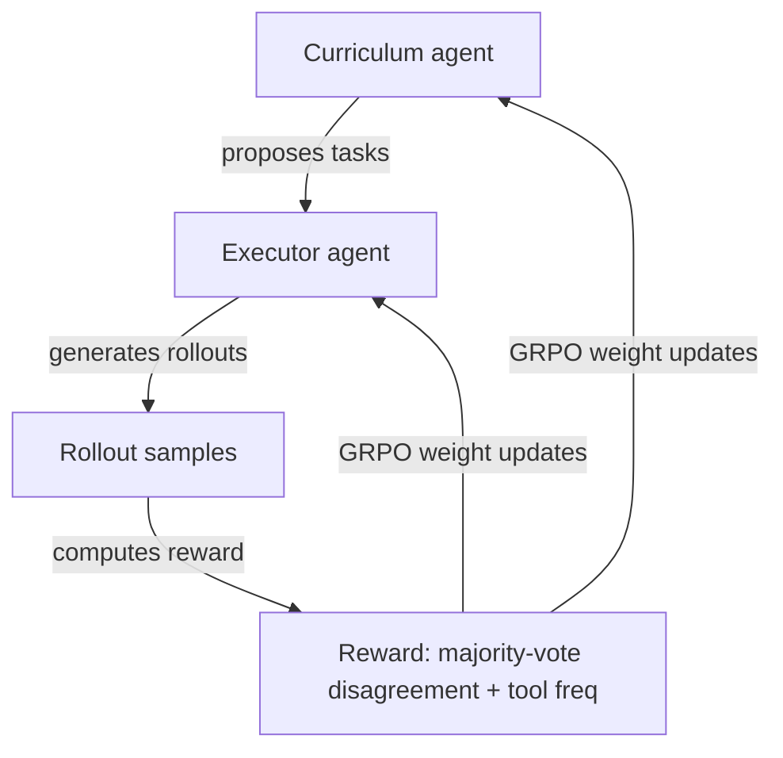
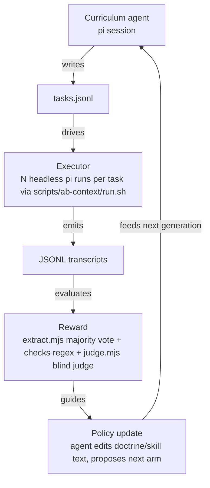

# agent0-self-evolving-loop-adaptation — Research

Research artifact. Explore-mode, no change / no impl. Question: can Agent0 (aiming-lab.github.io/Agent0, arXiv 2511.16043, Xia et al. UNC/Salesforce/Stanford, Nov 2025) be adapted to pi-agent-dashboard. Verdict: paper literally NO (RL on weights); pattern YES as text-policy evolution loop — repo already holds ~2/3 of it.

## What Agent0 is

- Two agents, same base model (Qwen3-8B-Base), co-evolve via RL (GRPO).
- Curriculum agent: proposes tasks at executor frontier. Reward = executor uncertainty (majority-vote disagreement) + tool-use frequency.
- Executor agent: solves tasks with python tool. Pseudo-label = majority vote across rollouts. Trains on filtered hard subset.
- Zero external data, zero human labels. Results: +18% math, +24% general reasoning.
- Agent0-VL (arXiv 2511.19900): same loop, Solver/Verifier roles, vision-language domain.

## The wall

- Ingredient 3 = RL updating model weights.
- Dashboard drives frontier API models via pi.
- No model weights, no local GPU cluster, no RL training loop.
- Direct paper implementation impossible for this project.

## Adaptable core: weights → text policy

- Behaviour-controlling surface repo owns = text: root `AGENTS.md`, `.pi/skills/*/SKILL.md`, subagent prompts, hermes memory.
- Text configuration acts as executable policy.
- Agent0 with text policy = doctrine/prompt evolution loop.

## Mapping onto repo

| Agent0 piece | Exists in repo | Missing |
|---|---|---|
| Executor + tool use | headless pi + `scripts/ab-context/run.sh`, `arms.json` | – |
| Task battery | `scripts/ab-context/tasks*.jsonl` (hand-written) | curriculum agent that writes them |
| Majority-vote pseudo-label | – | run each task N×, agree/disagree score |
| Uncertainty as curriculum reward | – | keep tasks with pass-rate ≈ 0.5, drop 0/1 |
| Judge | `scripts/ab-context/judge.mjs` blind rubric | – |
| RL update | `openspec/changes/ab-test-plain-language-rule` does it BY HAND (human proposes arm B) | agent proposing next arm |
| Orchestration | pi-flows `agent-loop-decision` step | wiring |

`ab-test-plain-language-rule` = one manual iteration of this loop. Agent0-ising = (a) curriculum agent generates battery, (b) loop runs unattended K generations.

## Risks

- Reward hacking = whole game. Agent0 majority vote works because math has checkable ground truth. Doctrine adherence = regex + LLM judge; evolving policy exploits regex gaps quickly. Antidote = existing pre-registration discipline (non-inferiority margin, identifier-retention guard in `ab-test-plain-language-rule`). Keep pre-registration; do not trade rigor for full autonomy.
- Cost. Agent0 needs thousands of rollouts. Repo rollout = real API-model pi session (~5 min wall time, jiti cold-boot). 5 tasks × 3 arms × N=5 ≈ 75 sessions per generation.
- Ceiling effect. `context-injection-ab-test.md` found test battery CUED (80–100% kb-first pass rate). Curriculum agent main job = surface tasks NOT at ceiling. Finding genuine frontier tasks = critical challenge.
- Policy target choice. Root `AGENTS.md` = every-turn token cost, high blast radius. Individual `SKILL.md` = scoped invocation, cheap revert. Start experiments on skill text.

## Open threads

1. Minimal spike: curriculum agent only. Feed pi session existing battery + `scripts/ab-context/judge-report.txt`; ask for 5 harder tasks; run battery; check frontier separation vs noise floor. No policy updates. Answers "is task synthesis viable".
2. Policy target: root doctrine vs skill text vs subagent prompt vs DocScribe caveman rule.
3. Hard oracle. Task classes with deterministically checkable label (tests pass, `kb dox lint` clean, e2e green) provide math-equivalent ground truth; majority vote not sole signal.
4. Agent0-VL Solver/Verifier pair as pi-flows template — alternative architectural reading of "adapt".

## Related

- `docs/research/context-injection-ab-test.md` — harness + experimental method
- `openspec/changes/ab-test-plain-language-rule/` — manual iteration artifact
- `docs/research/lora-dataset-from-pi-logs.md` — weight-side alternative
- `docs/research/session-derived-taste-learning.md` — prior verdict DO NOT BUILD, compare
- Skill `ab-test-context-injections` (`~/.pi/agent/projects-memory/pi-agent-dashboard/skills/`)
