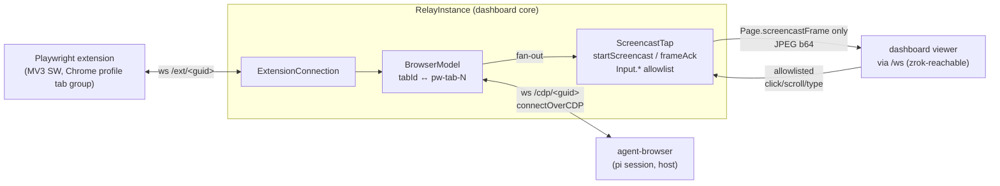

# Browser Relay via Playwright Chrome Extension — Research Record

Research artifact. Explore-mode output. No OpenSpec change, no implementation. Pickup-ready. 2026-09-13.
Live spike on macOS host (`/tmp/pw-ext/spike-relay.mjs` ~90 lines, extension 0.4.0, `Profile 37`).

---

## 0. Ask + verdict

Ask: Chrome plugin modelled on github.com/ManoloRemiddi/augmentor-dsh-extension-plugin — MV3 sidepanel chat + bespoke `browser_*` tools, native-messaging → DSH plugin WS.

Predecessors:
- `docs/research/browser-provider-registry.md` — registry first; extension = provider row; T1/T2 tiers.
- `docs/research/user-browser-in-editor-view.md` §6 — Runtime-domain ban, viewer path. §13 — hard rule: detect capabilities, pin explicitly, never silently fall back. §15 — one-browser ceiling.
- Shipped: `2026-05-28-ship-browser-skill-and-electron-cdp`, `2026-06-27-self-heal-host-playwright-browser`. Spec: `openspec/specs/default-browser-skill/spec.md`.
- Current own-browser provider Panerelay (`packages/extension/.pi/skills/browser/references/own-browser.md`) — live-broken on host, no CDP, fakes success.

Verdict: do NOT build Augmentor-shaped extension. Microsoft Playwright Extension (Web Store id `mmlmfjhmonkocbjadbfplnigmagldckm`, Apache-2.0, source `microsoft/playwright` `packages/extension/src/` ~800 lines) already IS "ext T2": perms `debugger tabs tabGroups activeTab`, host `<all_urls>`.

Relay side lives upstream: `packages/playwright-core/src/tools/mcp/{cdpRelay.ts 391, cdpRelayV2.ts 121, browserModel.ts 247, extensionContextFactory.ts 50}` lines.

`agent-browser connect <cdp-url>` exists → existing browser skill (snapshot/click/fill/screenshot, mockup-loop) runs against real logged-in profile unchanged. Zero new `browser_*` tools.

One Augmentor lesson kept: "no browser connected → tell user, never improvise headless fallback" (= §13).

## 1. Augmentor anatomy

Three runtimes, one codec:

- MV3 ext — sidepanel chat, `sw.js` executor + frost veil/click pulse, perms `tabs scripting activeTab sidePanel windows storage`, host `http/https *`.
- native-messaging `pipe.mjs` — loopback, token-gated.
- DSH `dsh-augmentor` plugin — tools `browser_tabs_list/navigate/snapshot/click/type`, WS `/api/augmentor`.

No `debugger` → ext T1. Lessons from changelog: 128-bit secret + endpoint file 0600 ("that file IS browser control"), `timingSafeEqual` compare, native-messaging 1 MiB frame cap kills host silently, MV3 SW 30 s idle-kill needs keep-alive.

## 2. Playwright extension + relay mechanics

Wire format (`relayConnection.ts`):
- relay→ext `{id, method, params[]}`; allow-list `ALLOWED_CHROME_COMMANDS = {chrome.debugger.attach, chrome.debugger.detach, chrome.debugger.sendCommand, chrome.tabs.create, chrome.tabs.remove}`; params spread positionally (`chrome.tabs.create [{url, windowId, active}]` works).
- ext→relay events: `chrome.debugger.onEvent`, `chrome.debugger.onDetach`, `chrome.tabs.onCreated`, `chrome.tabs.onRemoved`, plus `extension.initialized` — relay holds Playwright traffic until seen → `Target.setAutoAttach` answers from populated model.
- Response `{id, result|error}`.

Relay `CDPRelayServer`:
- Path `/cdp/<guid>` — Playwright `connectOverCDP`. Path `/extension/<guid>` — ext dials outbound.
- ONE `_extensionConnection` + ONE `_cdpConnection`. Second CDP socket closed `'Another CDP client already connected'` (line 209). Second ext socket closed (244).
- `BrowserModel` synthesizes `Target.attachedToTarget`/`detachedFromTarget`, sessionIds `pw-tab-N`, routes sessionId→tabId, tracks child sessions (workers/oopifs). `createTarget` = `chrome.tabs.create`. `Browser.getVersion` faked. Ctor takes `profileDirectory`.
- `establishExtensionConnection(clientName)` opens `chrome-extension://<id>/connect.html?mcpRelayUrl=…&client={"name":…}&protocolVersion=2[&token=…]`.

Multi-client = N relay instances — own guid, own ext socket, own coloured TAB GROUP. NOT N clients per relay. Per pi session = own tab group. Dissolves §15 ceiling inside one profile. Last controlled tab closed → socket closes (`'All controlled tabs detached'`).

Token (`ui/connect.tsx:96-103`, `authToken.tsx`): `localStorage['auth-token']` of extension origin → PER PROFILE. Shown as `PLAYWRIGHT_MCP_EXTENSION_TOKEN=…`. `?token=` match → no dialog. Mismatch → "Invalid token". Absent → Allow/Reject + optional tab pick.

HARD LIMIT `connect.tsx:61`: relay host must be `127.0.0.1`/`[::1]`. Stock ext loopback-only. Remote/docker Chrome impossible without fork.

Web Store 0.4.0 requires `protocolVersion=2` (`lib/ui/connect.js:6 SUPPORTED_PROTOCOL_VERSION = 2`); v1 → "The client uses an unsupported protocol version".

## 3. Option table

| | 1 Reuse MS ext + own relay | 2 Fork MS ext + own relay | 3 Augmentor-shaped from scratch |
|---|---|---|---|
| ext code owned | 0 | ~800 Apache-2.0 base | all |
| server code | relay port ~900 | same | relay + tool bridge + executor |
| agent tools | none (`agent-browser connect`) | none | `browser_*` via plugin bridge |
| screencast | `Page.startScreencast` over relay | same | must build |
| profile label | relay-side from `Local State` | same | same |
| veil/pulse UX | no | port | port |
| always-connected | no | yes (ext auto-dials `ws://127.0.0.1:8000`) | yes |
| remote Chrome | NO (loopback hard-coded) | yes + pairing token | yes |
| Web Store maintenance | Microsoft | ours | ours |
| Firefox | no | no | no |

1→2 graduation path — relay identical. Option 3 no advantage once sidepanel dropped. Option-2 triggers: remote Chrome, `systemOpen` false, separate agent window.

## 4. Thread 2 — security (grounded `packages/server/src/server.ts:2516`)

Existing upgrade gate chain: `evaluateHostGate` → `isWsOriginTrusted` (`auth/cors-origin.ts:214` → `isOriginAdmitted`: loopback / active zrok URL / `*.share.zrok.io`; only carve-out `scope==="live" && origin==="null"`) → `bridge` 400 → auth (cookie `validateWsUpgrade` | ticket `wsTicketStore.consume` | `verifyLocalToken` | `isGenuinelyLocal` | `isBypassedHost`) → route on `WsRouteScope` (`auth/ws-ticket.ts:30` closed union `"browser"|"terminal"|"live"|"bridge"`, `routeScopeForUrl` :53).

1. Extension socket REJECTED today: SW sends `Origin: chrome-extension://<id>` (verified live 2026-09-13: `origin = chrome-extension://mmlmfjhmonkocbjadbfplnigmagldckm`; Augmentor `trace/fence-probe-headless.json` 403 on same fence). Need new scope + PINNED ext-id allowlist admitted before generic origin gate. Web page cannot forge Origin.
2. No plugin WS-upgrade API (`ServerPluginContext` = `ctx.fastify`, `broadcastToSubscribers`, `registerPiHandler/registerBrowserHandler`). Fork choice: relay in CORE `packages/server/src/browser-relay/` (plugin = UI/config) vs upgrade hook in `dashboard-plugin-runtime`. Core smaller.
3. Endpoints:
   - `/ext/<guid>` — ext SW, same machine. Gate: `isGenuinelyLocal` OR per-profile token + pinned id. guid 128-bit, 0600, never logged.
   - `/cdp/<guid>` — pi session on host. Gate: `isGenuinelyLocal` + `localToken`. Never ticketable, never tunnel.

Verb policy: §6 Runtime ban = viewer path only; agent path needs `Target/Page/Runtime/DOM/Input/Emulation/Network.enable`. Relay deny-list: `Storage.getCookies`, `Network.getAllCookies`, `Browser.setDownloadBehavior`, `Page.navigate`/`Target.createTarget` to `file://` or outside per-profile `allowedDomains`. Denied → CDP error → loud fail.

Remote viewer: frames + allowlisted input via existing gated `/ws` gateway (`browser-gateway.ts`), NOT relay endpoints. v1 = Chrome on dashboard host only.

Kill switch `plugins.browser.enabled` + per-profile disconnect (tab-group colour disappears). Audit: attach/detach, navigate/createTarget URLs, denied verbs, no payloads; `GET /api/browser/audit`. Capability `capabilities.browserBridge = systemOpenCapability() && chromeFound` (`routes/system-routes.ts:846`).

## 5. Thread 3 — profile reach (live host 2026-09-13)

17 profiles in `~/Library/Application Support/Google/Chrome/Local State → profile.info_cache` (`Default`, `Profile 1`, `Profile 21…37`, `AgentAutomation`), each with `name`+`user_name` (`Profile 23 → robson@semmi.se`, `Profile 37 → OSS`). Registry source; no `chrome.identity`; labels free.

VERIFIED: `open -na "Google Chrome" --args --profile-directory="Profile 37" <url>` with Chrome running → URL opens in that profile window (new `Profile 37/Sessions/Tabs_*` at launch second, `profile.last_used` → `Profile 37`). Relay mints guid → guid↔profile relay-side. Requires `systemOpen`.

Per-profile capabilities (§13): `installed` = `<profile>/Extensions/mmlmfjhmonkocbjadbfplnigmagldckm/` exists (0/17 before spike; now `Profile 37/…/0.4.0_0`); `token` optional; `connected` live. Parallel profiles = one Chrome process, one SW per profile. `systemOpen` false (docker/headless) → `browserBridge=false` → Option-2 trigger.

## 6. Thread 1 — screencast tap

`chrome.debugger.attach` = one session per tab per extension; second impossible. Human DevTools on tab → detach `canceled_by_user`; ext reattaches only on `target_closed` (150 ms delay, 3000 ms cooldown). Surface in UI.

Viewer = in-process tap on RelayInstance, NOT second CDP client.

Rules:
1. `BrowserModel._emit` → listener list.
2. Tap owns `Page.startScreencast`/`screencastFrameAck` via `_model.sendCommand`; ids promise-mapped, no clash.
3. Filter `Page.screencastFrame` from Playwright stream while tap active; deny CDP-client `Page.startScreencast` (Playwright `CRPage` acks frames, video path).
4. Viewer input `Input.dispatchMouseEvent`/`dispatchKeyEvent`/`synthesizeScrollGesture` only; never `Runtime.*`.
5. Ack immediately; drop per viewer on `ws.bufferedAmount` > threshold.
6. Tap stops on last unsubscribe / tab leaves group; instance dies with ext socket.

Message: `browser_relay_frame`.

## 7. Live spike 2026-09-13

`/tmp/pw-ext/spike-relay.mjs` ~90 lines, ext 0.4.0, `Profile 37`, jpeg q50 800×600.

| tab state | frames / 5 s | note |
|---|---|---|
| visible idle | 0 | emit on repaint only |
| visible repainting (bg colour every 100 ms) | 49 ≈ 10 fps | 207 KB b64 ≈ 4 KB/frame |
| HIDDEN (second active tab) | 0 | |
| after `Page.bringToFront` | 50 / 5 s | |

`chrome.windows.create` → `Unknown method`. `chrome.tabs.update` → `Unknown method`.

Verdict: viewer detects frame starvation → "Bring to front" = `Page.bringToFront`. Separate window = fork-only; `chrome.tabs.create {windowId}` can place tabs in chosen EXISTING window (windowId from `chrome.tabs.onCreated`).

Traps: server inside context-mode `ctx_execute` sandbox → inbound blocked ("Failed to connect to MCP relay: WebSocket error"); run relay from plain shell. `protocolVersion=2` mandatory.

## 8. Shipped: `add-browser-relay` (sketch superseded)

Implemented. Ground truth: `openspec/changes/add-browser-relay/` (proposal/design/tasks/specs). Architecture: `docs/architecture.md` §Browser relay.

- Relay lives in the PLUGIN (`packages/browser-plugin/`), not core `packages/server/src/browser-relay/` — the sketch's core placement was superseded by the plugin-owned `registerWsRoute` seam (design D1). Vendored playwright-core relay under `packages/browser-plugin/src/server/relay/vendor/` (Apache-2.0, hash-pinned).
- Plugin `packages/browser-plugin/`: settings (profiles from `Local State`, installed/token/connected, kill switch, audit), `session-card-badge` status subscriber, live-view tile.
- Config `plugins.browser.{enabled, browsers:{<profileDirectory>:{token?, zeroDialog?, allowedDomains?}}, defaultBrowser, allowMultipleInstancesPerProfile}`. `token` is `writeOnly` (redacted, fail-closed); `defaultEnabled:false`.
- REST: `GET /api/browser/status`, `GET /api/browser/profiles`, `POST /api/browser/connect` (body `{profileDirectory}`), `POST /api/browser/disconnect?instanceId=`, `GET /api/browser/audit`, `PUT /api/browser/enabled`, `PUT /api/browser/profile`. NO cdpUrl-lookup endpoint (deliberate: REST carries no pi-session identity).
- Skill `references/dashboard-relay.md`; rule "logged-in state needed → `POST /api/browser/connect` then `agent-browser connect <cdpUrl>`"; Panerelay → legacy.
- Discipline skills: security-hardening, observability-instrumentation, doubt-driven-review.

Delivered (was deferred): live-view tile, DevTools-conflict UX. Still deferred: remote Chrome (fork), separate window (fork), 17-profile token onboarding.

## 9. Sources

- microsoft/playwright main `packages/extension/src/{background,relayConnection,pendingConnection,ui/connect.tsx,ui/authToken.tsx}`, `packages/playwright-core/src/tools/mcp/{cdpRelay,cdpRelayV2,browserModel,extensionContextFactory}.ts` (2026-09-13).
- ManoloRemiddi/augmentor-dsh-extension-plugin README + PROPOSAL-plugin-architecture.md.
- Installed ext `Profile 37/Extensions/…/0.4.0_0`.
- Repo: `server.ts:2516`, `auth/cors-origin.ts:214`, `auth/ws-ticket.ts:30,53`, `auth/localhost-guard.ts`, `system-open-capability.ts:32`, `routes/system-routes.ts:846`, `dashboard-plugin-runtime/README.md`.
