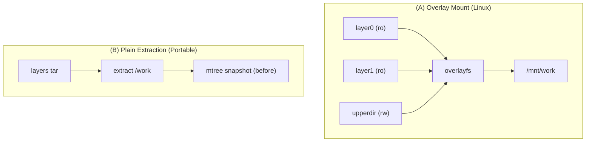
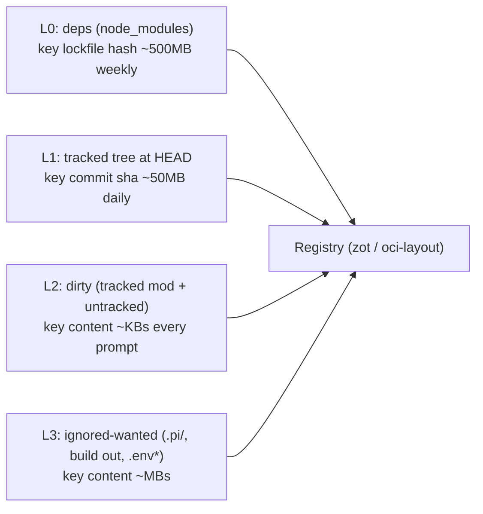
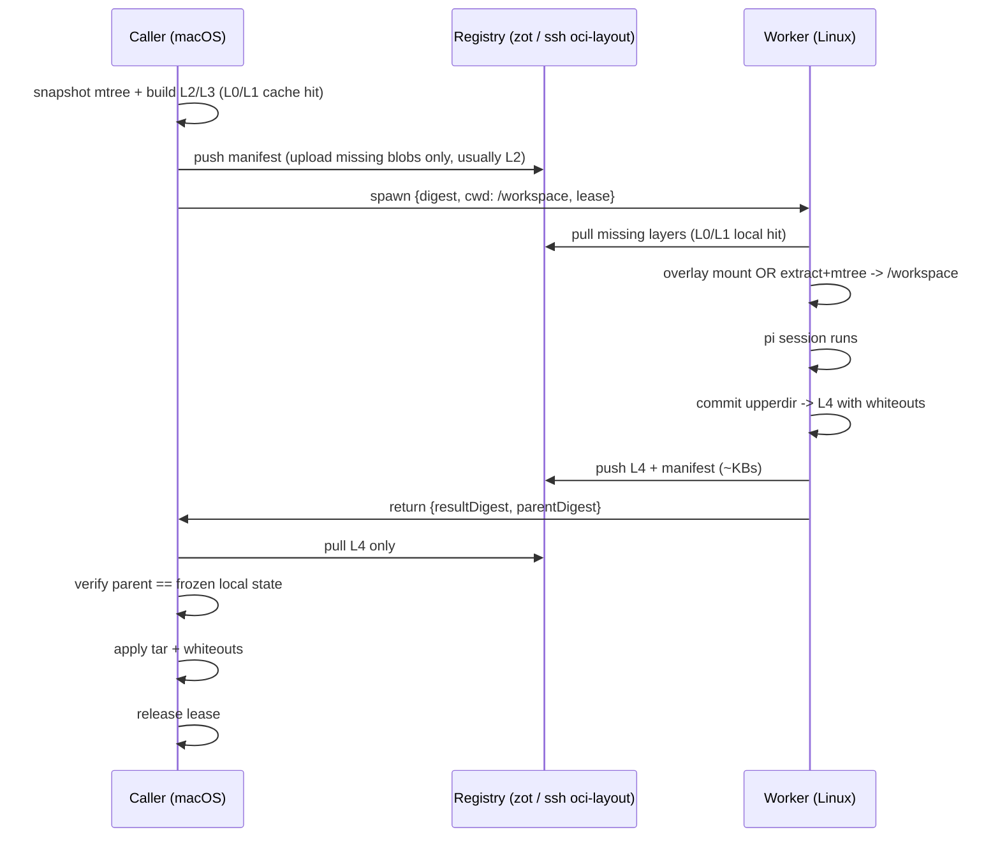

# OCI cwd delegation — snapshot CWD, spawn remote, delta back

Research dossier. Explore-mode, no change / no impl.
Date: 2026-09-14.
Status: OPEN — research, continue later.
Problem statement: sharing working tree between worktrees + other machines hard; git wrong tool for binaries/untracked/ignored/`.pi/` state.

## Problem

Dashboard moves sessions (WS), assumes filesystem local.
Nothing moves working tree between machines today.
Related repo surface:
- Worktree spawn dialog: local/remote branch sections.
- `packages/server/src/spawn-process/spawn-preflight.ts`: cwd validation checks.
- `docker/` all-in-one harness: `PI_WORKSPACES` bind mounts, pi gateway port for external sessions.
- `.pi/settings.json` in `.worktrees/<name>`: gets `packages[].source` rewritten to absolute machine path (known gotcha).
- Session-diff UI: change `fix-session-diff-durable-source`.

## Q1 — OCI image from a CWD: YES, daemon-free

OCI image = `manifest.json` → `config.json` + N layer tarballs.
Content-addressed via sha256 digests.
Requires no Dockerfile, no daemon.

| Tool | Makes image from dir | Daemon | Notes |
|---|---|---|---|
| `crane append -f <tar> -t reg/img` | yes, 1 layer/call | no | `go-containerregistry`, runs on macOS |
| `oras push` | yes, OCI artifact, custom `mediaType` | no | Use when runtimes must not treat artifact as runnable image |
| `umoci unpack` / `umoci repack` | yes AND diffs dir back into new layer | no | Keeps mtree manifest of unpacked rootfs; repack diffs dir → layer with whiteouts |
| `buildah from` + `buildah mount` + `buildah commit` | yes | no daemon, Linux only | Mount returns host path of writable overlay; commit turns upperdir → layer |
| `docker build COPY . /w` | yes | yes | Slow context tar, wrong tool |

## Q2 — "mount as physical dir" on remote: two meanings

- Overlay mount (`podman image mount`, `buildah mount`, `ctr image mount`, `docker run -v`): image forms directory directly; writes land in upperdir; diff equals upperdir. Linux only. macOS lacks overlayfs; Docker Desktop runs Linux VM; "physical dir" sits inside VM shared via virtiofs; virtiofs exhibits severe latency on `node_modules`-shaped trees.
- Extraction + mtree: extract layers to plain directory; record mtree (`umoci` native; `bsdtar --format=mtree` on macOS + Linux). Worker performs modifications. Re-run mtree → compute added/modified/deleted files → emit layer tar containing `.wh.<name>` and `.wh..wh..opq` whiteouts. Portable across macOS + Linux; requires no container runtime, no root privileges. Size + mtime short-circuit yields `git status`-level speed.
- Takeaway: portable "mount" = extract + remember before-state. Overlay mount = optimization when remote host runs Linux.

## Q3 — changes → new layer: best practice?

- Literal OCI mechanism: upperdir → tar diff → layer.
- For BUILDING images: no. `docker commit`-style produces opaque snapshots, unreproducible builds, unreviewable diffs ("anti-pattern").
- For CHECKPOINTING state: yes. Dagger, BuildKit cache, Modal volumes, Codespaces prebuilds, Nix/Bazel remote-exec ship content-addressed filesystem snapshots. Delegation delta represents state checkpoint, not image build.

| Issue | Why | Mitigation |
|---|---|---|
| Whole-file granularity | No sub-file delta, no rename tracking | Acceptable for text; large binaries re-ship; CDC (kopia/restic) wins on binaries |
| Layer accumulation | Each round trip stacks new layer | Consume returned layer into CWD, rebuild base; never stack indefinitely |
| Spurious changes | mtime/uid/gid/xattr churn | Diff on size+hash; normalize uid/gid; retain mtime in tar (Vite/tsc rely on timestamps) |
| macOS vs Linux | Case-insensitive FS, `._*` AppleDouble, resource forks | Export `COPYFILE_DISABLE=1`; reject case collisions at snapshot phase |
| Symlinks | pnpm `node_modules` forms symlink forest | Standard tar preserves symlinks; never dereference symlinks during archiving |
| Absolute paths | `.pi/settings.json` `source:"/Users/robson/..."` rewrite in worktrees | Use fixed mount path on both sides (`/workspace`) or rewrite paths on ingress/egress |
| No merge semantics | OCI applies last-writer-wins per file | Enforce lease: freeze caller CWD while delegated; lease violation triggers 3-way merge per file with base layer as ancestor |

Verdict: good transport + identity format (digest acts as state id, registry deduplicates blobs, ecosystem tooling ubiquitous); acceptable delta format; bad diff format for human inspection → pair with session-diff for text changes.

## Q4 — fast delegation: layer by change frequency

Delegation speed derives from blobs pre-existing on remote, not OCI transport itself.

Operational notes:
- Warm base layers once → spawn transfers single-digit kilobytes.
- Lazy-pull (eStargz/SOCI/Nydus) helps only when base layer absent; pre-warming eliminates need.
- L1 alternative: record `commitSha`; worker runs `git fetch`; OCI transports dirty files, untracked files, ignored files, and binaries only (hybrid mode).
- Registry: run `zot` sidecar in `docker/compose.yml` (single service); daemonless fallback: `skopeo copy oci:./layout ssh://…` or `oras cp`; transport over zrok exposes standard HTTP port.
- Return apply on macOS: tar extraction plus delete-on-`.wh.` handler takes ~50 lines shell/JS; requires no daemon.

## Alternatives compared

| Approach | Delta out | Delta back | Binaries | macOS ↔ Linux | Snapshot identity | Runtime | Fit |
|---|---|---|---|---|---|---|---|
| git bundle / WIP commit + stash | good | good | poor, drops ignored/untracked | yes | commit sha | none | Text only; rejected |
| rsync two-way | great sub-file | great | ok | yes | none | ssh | Simplest transport; lacks checkpoint id; manual conflict resolution |
| Mutagen bidirectional | continuous | continuous | ok | yes | none | agent binary | Optimal for concurrent watch/edit loops; poor for discrete delegation |
| NFS / SSHFS / virtiofs | live | live | ok | yes | none | server daemon | Network latency degrades pnpm, `git status`, Vite watcher |
| ZFS / btrfs send | superb block-level | superb | superb | NO (macOS lacks both) | yes | kernel filesystem | Linux ↔ Linux only |
| kopia / restic CDC snapshots | sub-file dedup | sub-file | great | yes | snapshot id | none | Strongest alternative; superior binary deduplication; lacks native mount+upperdir primitive |
| OCI layers | whole-file, blob dedup | whole-file | ok | yes | digest sha256 | none (mtree) / overlay (Linux) | Solid checkpointing + transport; standard tooling ecosystem |
| BuildKit local source (`fsutil`) | incremental hash | `--output type=local` | ok | yes | cache key | `buildkitd` | Matches `docker build` file-shipping mechanism; requires daemon |

Fork in design:
- Checkpoint semantics (delegate session, return delta): choose OCI layers or kopia CDC + caller lease.
- Live synchronization (user edits concurrently): choose Mutagen; accepts ongoing sync-conflict debt.

## Dashboard hang points

- Spawn dialog: requires "run on peer" flow → worker registration mechanism (current peers handle anthropic bridge only, not compute workloads).
- `spawn-preflight.ts`: provides target hook for snapshotting CWD → emitting digest.
- `docker/` image: serves as worker execution image (pi + tmux); fixed `/workspace` path eliminates `.pi/settings.json` host-path rewriting trap.
- Session-diff UI: inspects text changes; returned layer manifest inspects binary changes (added, removed, modified).

## Open questions (answer before proposal)

1. Concurrency model: caller lease (frozen caller CWD) vs concurrent editing → dictates OCI vs Mutagen choice.
2. Transport hybridity: determine if git-for-tracked + OCI-for-rest acceptable; pure OCI required only when workers lack git remote access.
3. Worker OS support: Linux workers enable native overlayfs; macOS workers require mtree fallback; build mtree engine first regardless.
4. Delta return scope: determine whether to bring back `node_modules` or build artifacts; default policy excludes L0 from return layer.
5. Telemetry: measure real-world L2+L3 payload sizes across active worktrees before committing to CDC deduplication.

## Next spikes (read-only, cheap)

- Measure L2/L3 in repository: inspect `git status --porcelain`, enumerate ignored-but-wanted files, record `du -sh` measurements.
- Prototype mtree → layer diff on scratch directory: run `bsdtar --format=mtree`, compute differences, generate tar archive with `.wh.*` whiteouts, append via `crane append`.
- Evaluate `umoci` behavior on macOS vs implementing pure-Node tar + sha256 OCI layout builder.
- Measure memory and disk footprint of `zot` registry sidecar inside `docker/compose.yml`.

## Continue this research

Reopen explore mode with this file.
Questions listed above remain open.
No code changes implemented.
