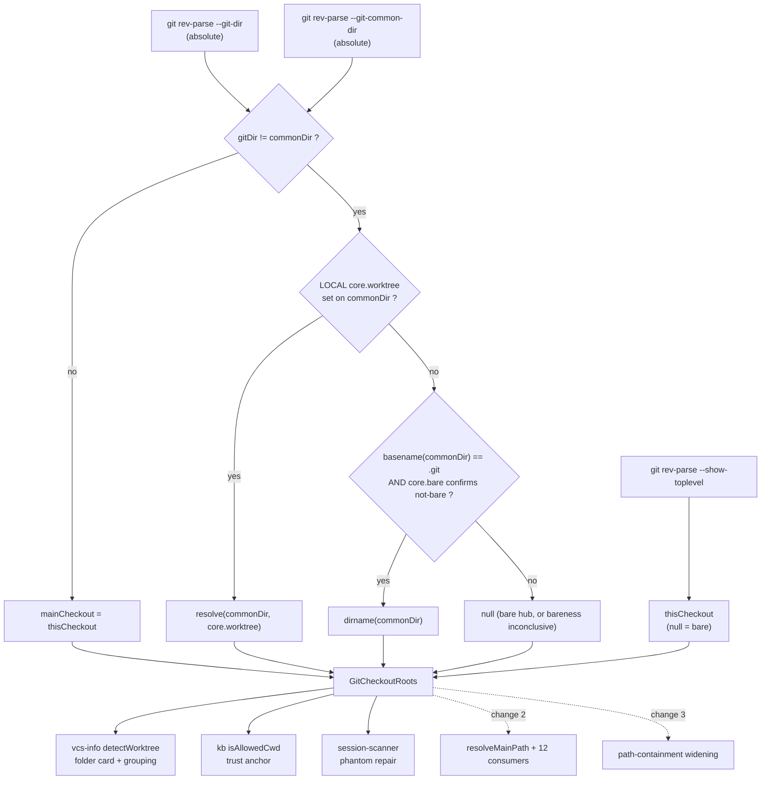

## Why

A pi session whose cwd is a **git submodule** shows a folder card headed
`…/judo-ng/.git/modules/models`, a permanent "Not a pi project yet — Set up" banner, and a
"KNOWLEDGE BASE: not indexed" badge — while the same checkout works normally from the CLI.
The directory in the header does not exist.

The cause is one line of path arithmetic, copied across the repo:

```
path.dirname(git rev-parse --git-common-dir)
```

That expression assumes the git dir always sits *inside* the checkout it belongs to, so its
parent is the checkout root. That holds for a normal checkout and an ordinary linked worktree,
and fails everywhere else. Measured on fresh fixtures:

| case | `--git-common-dir` | `dirname()` | correct? |
|---|---|---|---|
| normal checkout | `…/super/.git` | `…/super` | yes |
| linked worktree | `…/super/.git` | `…/super` | yes (main checkout — intended) |
| **submodule** | `…/super/.git/modules/models/sub` | `…/super/.git/modules/models` | no — path does not exist |
| **worktree of a submodule** | `…/super/.git/modules/models/sub` | `…/super/.git/modules/models` | no — path does not exist |
| **`--separate-git-dir`** | `…/tmp/elsewhere.git` | `…/tmp` | no — a real, unrelated directory |
| **bare repo** | `…/bare.git` | `…/tmp` | no — parent of unrelated files |
| **worktree of a bare hub** | `…/barehub.git` | `…/tmp` | no — a real, unrelated directory |

The `--separate-git-dir` and bare rows are the dangerous ones: they resolve to a directory
that **exists** and is **unrelated**, so nothing looks wrong.

The assumption is also **codified in three specs and in the shared type**, which is why it
keeps regrowing:

- `openspec/specs/git-context/spec.md` — "`mainPath` SHALL be … the parent of `git-common-dir`";
- `openspec/specs/bridge-session-state-poll/spec.md` — "Scenario: Worktree identity is derived
  from git-common-dir vs toplevel";
- `packages/shared/src/types.ts:52` — calls the outside-toplevel test "**the canonical
  signal** that this cwd is a worktree".

All three encode a two-state world. There are at least seven states, and the distinctions that
matter cannot be recovered from `--git-common-dir` alone.

## What Changes

**Product decision (decided, not open): a submodule is an independent project.** It gets its
own top-level folder card at its own checkout path. Its superproject is ignored — no nesting,
no grouping, no `superproject` field. `judo-meta-asm` carries its own `.pi/`, `openspec/` and
`AGENTS.md`; it *is* a project, and it happens to also be a submodule.

**Scope: this change introduces the shared resolver and converts only the read-only consumers
that hold their own private copy of the arithmetic.** It deliberately does not touch
`resolveMainPath`, whose twelve consumers include two recursive-delete boundaries, nor the
file-read containment helper. See *Sequence* below — that split is the outcome of review, not
an accident.

- **One shared resolver** returns the three facts consumers actually need, instead of one
  overloaded path:

  ```ts
  type GitCheckoutRoots = {
    thisCheckout: string | null;   // --show-toplevel; null for a bare repo
    isLinkedWorktree: boolean;     // --git-dir !== --git-common-dir
    mainCheckout: string | null;   // primary working tree; null when the repo has none
  };
  ```

- **Worktree identity comes from `--git-dir != --git-common-dir`**, the only signal exact
  across every measured state. The current "common dir outside toplevel" test misclassifies a
  submodule as a worktree; a `basename(commonDir) === ".git"` test — the guard
  `path-containment.ts:94` already ships — instead misclassifies a *worktree of a submodule*
  and a *worktree of a bare hub* as non-worktrees. Both were measured; neither proxy survives
  contact with the real states.

- **`mainCheckout` is resolved, not derived from a substring**: `thisCheckout` when the cwd is
  not a linked worktree; otherwise repository-**local** `core.worktree` on the common dir
  (which recovers `/super/models/sub` for a worktree of a submodule), else
  `dirname(commonDir)` when the common dir is named `.git` **and repository-local `core.bare`
  confirms the repo is not bare**, else `null` — a bare hub has no working tree to name. The
  bareness read is `--type=bool` (git accepts `yes`/`on`/`1`) and THREE-valued. An UNSET key
  is `not-bare` — that is a successful read of git's own boolean default, not a failure to
  read — while a command error, timeout or unparseable value is `unknown`. Only `not-bare`
  takes the fallback, so a bare hub that is itself named `.git`, and an unanswerable probe,
  both resolve to `null` instead of exposing the parent as `mainCheckout`.

- **Both probes are read in canonical absolute form.** `--git-dir` reports the relative `.git`
  at a checkout root and an absolute path from a subdirectory, and this repo already mixes two
  conventions. Since the classifier is an equality test, mismatched forms would make **every
  normal checkout** report as a linked worktree.

- **Persisted phantom paths are repaired on load, not waited out.** `gitWorktree.mainPath` is
  written to session metadata and re-seeded at every boot, and an ended session never polls
  again, so today's phantom values are immortal. The scanner drops a record whose `mainPath`
  is not a plausible working tree: it must exist, contain no `.git` path segment, **and** carry
  a `.git` entry of its own — that last condition is what catches the `--separate-git-dir` and
  bare phantoms, which point at real, existing, unrelated directories.

- **The two stale specs and the type docstring are corrected**, or the assumption regrows.



## Capabilities

### New Capabilities

- `git-checkout-root-resolution`: the shared contract for resolving a cwd's checkout roots —
  `thisCheckout`, `isLinkedWorktree`, `mainCheckout` — across every git state, including probe
  canonicalization, bare-vs-non-repo distinguishability, and the best-effort repair of
  persisted implausible worktree paths.

### Modified Capabilities

- `git-context`: worktree identity and `mainPath` derive from the resolver, not from
  `--git-common-dir` vs `--show-toplevel` and not from that path's parent.
- `bridge-session-state-poll`: same correction on the poll path. A submodule is NOT a worktree;
  a worktree of a submodule IS one; a worktree of a bare hub reports no worktree identity.
- `kb-plugin-cwd-guard`: git-repo-main admission anchors on the resolved `mainCheckout`, so a
  submodule does not inherit its superproject's trust and a `--separate-git-dir` cwd is not
  admitted via the unrelated directory holding its git dir.

## Impact

- **New shared resolver** in `packages/shared/src/platform/git.ts` (which already exports the
  `GIT_COMMON_DIR` / `GIT_TOPLEVEL` recipes and is already imported by extension and server),
  plus unit tests over every git state.
- **Three converted consumers**, each holding its own private copy today:
  - `packages/extension/src/vcs-info.ts:112` — `detectWorktree` → folder-card header and
    `session-grouping.ts:103` grouping key;
  - `packages/kb-plugin/src/server/kb-routes.ts:80` — `worktreeMainPath` → `isAllowedCwd`;
  - `packages/server/src/session/session-scanner.ts:138` — drops an implausible persisted
    `gitWorktree` on load.
- `packages/shared/src/types.ts:44-52` — the `GitWorktreeInfo` docstring describes the old
  signal across its whole opening paragraph, not only the "canonical signal" sentence. The
  whole paragraph is rewritten. `detectWorktree`'s own docstring also claims case-folding it
  does not implement; corrected while rewriting.
- Per-file `AGENTS.md` purpose rows + `See change:` for every touched source file.

**One converted site is a security boundary:** `kb-routes.ts:80` feeds `isAllowedCwd`, a trust
anchor. A submodule currently derives a `.git/modules/…` parent that is never a known folder →
denied (wrong but safe). Under `--separate-git-dir` the derived parent is a real sibling
directory that *could* be known → over-admission. Anchoring on `mainCheckout` closes it. The
change is stricter, not looser, in every state except two, both deliberate: a submodule (and a
worktree of one) admitted on its own cwd, and a linked worktree whose repository-**local**
`core.worktree` names a known folder — the resolver returns that value verbatim, and the guard
rejects it only when it contains a `.git` segment. The second is bounded and accepted: the store
always opens at the request's own `cwd`, inside the repo whose `core.worktree` the requester
already controls, so reach stays within the requester's own files. See `design.md` — Risks;
change 3 must NOT inherit that reasoning.

## Sequence

Three doubt-review cycles established that the original single change spanned twelve
consumers, two recursive-delete boundaries and a containment helper. It is split by consumer
graph so each security boundary gets its own review surface:

1. **This change** — resolver + the three private-copy read-only consumers. Fixes the folder
   header and the KB badge.
2. **`apply-checkout-root-to-worktree-ops`** (follow-up) — `resolveMainPath` and all twelve
   consumers: `resolveConfigRoot` (fixes the remaining "Not a pi project yet" symptom),
   `addWorktree`, `createWorktreeFromPr`, `orphanCleanup`, `removeWorktree` →
   `sweepResidualWorktreeDir`, `pruneWorktrees`, `mergeWorktree`, `createPr`, `isMainWorktree`.
   Touches **two** recursive-delete boundaries and carries a known regression to design for
   (a worktree-of-bare would flip `isMainWorktree` to true). Also owns the pre-existing
   `git-operations-api` spec/code divergence on the `orphan-cleanup` boundary ("inside `cwd`"
   vs the derived root) and the `isGitRepo`/bare rewiring that `resolveConfigRoot` needs.
3. **`widen-containment-to-resolved-checkout`** (follow-up) — `path-containment.ts`. This is a
   deliberate **widening** of file-read containment for submodule and `--separate-git-dir`
   sessions (from cwd-only to their own checkout), so it needs its own `file-read-containment`
   deltas — both requirements mandate `dirname()` today — plus tests for the widened states,
   which the current tests do not cover.

**Also out of scope:** `listWorktrees()` reports the gitdir as the main worktree for submodule,
bare and `--separate-git-dir` repos, parsing `git worktree list` independently of this
resolver. Cause now understood and recorded; belongs with change 2.

**Known limitation, accepted:** the persisted-record repair is a shape test, not an identity
check. A phantom that lands on a directory which is itself a working tree — a bare hub at
`$HOME/bare.git` whose phantom is `$HOME`, when `$HOME` is a dotfiles repo — survives it.
Measured and confirmed. Repairing it would mean re-probing git for every persisted session at
startup; not worth the cost.

## Discipline Skills

- `security-hardening`: triggered by the `isAllowedCwd` trust anchor, which derives an
  admission root from repo layout. The pass must confirm every git state fails **closed**, and
  that a submodule moving from "denied" to "admitted on its own cwd" does not widen reach
  beyond that cwd.
- `doubt-driven-review`: **already run for three cycles on the original single-change draft.**
  Cycle 1 invalidated the first discriminator (`basename(commonDir) === ".git"` misclassifies
  a worktree of a submodule and of a bare hub — both confirmed on fixtures). Cycle 2 found the
  persisted-repair hole, a shell-injection vector in the config probe, and a security widening
  wrongly asserted to be behaviour-preserving. Cycle 3 found six uninventoried
  `resolveMainPath` consumers and two stale sibling specs, which is what produced the split
  above. Re-run on this narrowed artifact before implementation.
- `systematic-debugging`: if any fixture state disagrees with the tables above, the fixture is
  the evidence and the table is the hypothesis — re-measure before adjusting the resolver.
- `review-code`: standard pre-commit review, covering in particular that the `core.worktree`
  probe is argv-based and repository-local. A merged read returns a global value (measured),
  and the server's `tryRun` is `execSync` over a shell string where every existing command is
  a constant — interpolating a cwd-derived path there is both a word-splitting and an
  injection hazard.
- `performance-optimization` not triggered: the kb guard goes from one probe to three, on a
  cold admission path already doing disk I/O; the scanner adds one `stat` per session on load.
- `observability-instrumentation` not triggered: no new endpoint, job, or external call.
