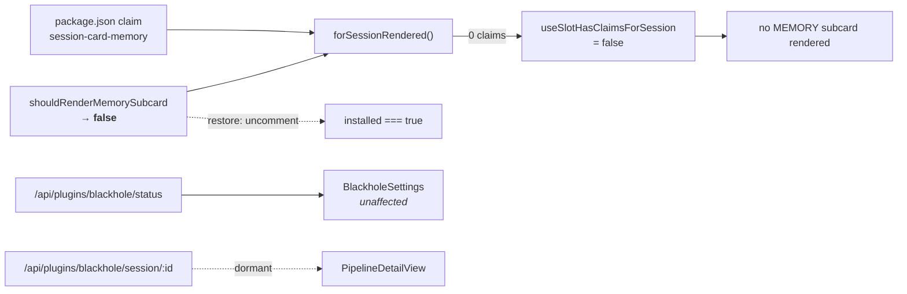

## Why

The blackhole MEMORY subcard was specced as a **monitor** and built as a **permanent readout**.
In the healthy case — which is the case essentially all the time — it spends fixed session-card
real estate to say nothing:

```text
observer● reflector● dropper●
Compaction proximity ~=
▼ why is this approximate?
```

Three problems, in descending order of severity:

1. **No CSS ever shipped.** The component emits BEM class names that nothing in the repo
   defines:

   ```console
   $ rg "bh-mem|bh-settings|bh-pipeline" -g '*.css' packages/
   no output
   $ find packages/blackhole-plugin -name '*.css'
   no output
   ```

   So `.bh-mem__proximity-track` / `__fill` — the proximity meter — have no width, height or
   background and render **invisible**; `.bh-mem__row` does not lay out horizontally; the
   worker states degrade to bare `●` glyphs run together without spacing. Every visual
   affordance the design assumed is absent.

2. **The most prominent element is redundant.** Compaction proximity is derived from the same
   `contextTokens` that `ContextUsageBar` already renders a compaction badge from, via
   `deriveCompactionBadge()`, on the same card — except exactly, and without the three-line
   "this is an approximation" disclaimer the spec requires the subcard to carry.

3. **It is read-only by design.** `spec.md:311` — "the plugin SHALL NOT write to blackhole's
   per-session file, trigger compaction, or flush pending batches." Controls live in
   `BlackholeSettings` (global) and the `/blackhole` pi command (flush). So the card offers no
   action to take on what it reports.

The genuinely unique signal — a worker on a fallback model with a cooldown, or unflushed
pending batches — is **conditional** and did not fire. Nothing else on the card is information
that does not already exist elsewhere.

## What Changes

**The surface is parked, not removed.** Every component, its tests, the server route and the
manifest claim stay exactly where they are. One gate flips:

```ts
// packages/blackhole-plugin/src/client/installed-gate.ts
export function shouldRenderMemorySubcard(_session?: unknown): boolean {
  // TEMP: MEMORY subcard parked — not informative enough. The resolve state
  // machine below is left fully intact; restore by swapping these two lines.
  // return installed === true;
  return false;
}
```

The manifest claim survives because `forSessionRendered` filters claims whose `shouldRender`
returns false, so `useSlotHasClaimsForSession` counts the slot empty and the host renders no
MEMORY subcard at all.



`PipelineDetailView` becomes unreachable: `isPipelineDetailActive` is a module-scoped
explicit-navigation flag that starts `false` and only flips from the subcard's "Details"
button. It was already inert by default, so this is dormancy, not dead code.

**Why park rather than delete.** The components and their 190 tests still pass and still
describe correct behaviour. Deleting them would discard the work and force a rebuild if the
card is ever given CSS and an exception-only render policy — which is the likely successor.
Parking costs one commented line and reverts by uncommenting it.

## Capabilities

### Modified Capabilities

- `blackhole-plugin-session-pipeline`: the `session-card-memory` contribution never mounts.
  The gate returns `false` unconditionally rather than reporting resolved installed-state. The
  subcard-rendering and detail-view requirements are **dormant, not withdrawn** — they still
  hold under unit test and govern again on restore.

## Impact

- `packages/blackhole-plugin/src/client/installed-gate.ts` — gate returns `false`; the original
  expression is retained as a comment directly above it.
- `packages/blackhole-plugin/src/client/__tests__/installed-gate.test.ts` — 2 `.toBe(true)`
  assertions commented out. The adjacent `bumps` / `calls()` assertions still cover
  resolve-finalization, so the state machine keeps its coverage.
- `packages/blackhole-plugin/src/client/__tests__/client-entry.test.ts` — 1 `.toBe(true)`
  assertion commented out.
- Per-file `AGENTS.md` purpose row for `installed-gate.ts` + `See change:`.

**Deliberately untouched:** `MemorySubcard.tsx`, `PipelineDetailView.tsx`, `pipeline-state.ts`,
`pipeline-api.ts`, `detail-navigation.ts`, the `session-card-memory` and `content-view` claims
in `package.json`, `GET /api/plugins/blackhole/session/:id`, and the two platform capabilities
that change added (`ServerPluginContext.isPiExtensionInstalled`, `bumpSlotClaimsVersion()`).
Those two are generic, tested, additive platform API used by the settings surface and the
runtime; ripping out plumbing is not in scope for hiding a card.

**Not the same as disabling the plugin.** `plugins.blackhole.enabled = false` in
`~/.pi/dashboard/config.json` zeroes *all* claims, taking `BlackholeSettings` with it. The
settings surface is the one part of this plugin that is unambiguously useful, so it stays.

**Known limitation, accepted:** the conditional degraded/pending advisories — a reflector on a
fallback model with a cooldown, unflushed batches in manual mode — are the one signal that
exists nowhere else in the dashboard, and parking the card makes them invisible too. That
reinstates part of the gap the original change was written to close. Accepted because the
advisories fire rarely and the card's cost is paid continuously; the successor change should
bring them back as an exception-only render.

## Discipline Skills

- `review-code`: standard pre-commit review. The specific thing to check is that the commented
  test assertions did not silently vacate coverage of the resolve state machine — the
  remaining `bumps` / `calls()` assertions must still distinguish "resolved" from "never
  resolved", or the retry/backoff logic is now untested.
- `code-simplification` not triggered: this change deliberately adds a dead branch rather than
  removing one. Simplifying it would mean deleting the parked code, which is the outcome this
  change exists to avoid.
- `security-hardening` not triggered: no auth, untrusted input, secrets or PII; the change only
  removes a read-only surface.
- `performance-optimization` not triggered: strictly fewer components mounted.
- `observability-instrumentation` not triggered: no new endpoint, job or external call. Note
  the change *reduces* observability, which is the accepted trade-off recorded above.
- `doubt-driven-review` not triggered: fully reversible by uncommenting one line, with no
  migration, no public API change and no data loss.
