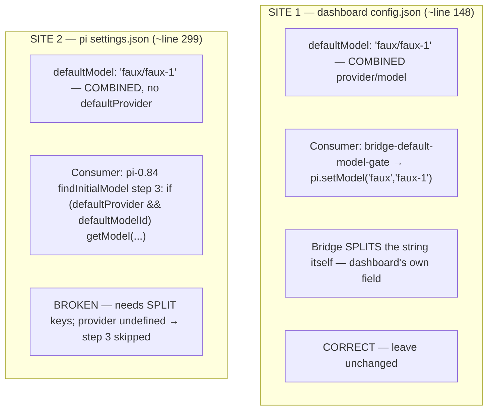

# Design: split faux settings-seed for pi-0.84

## Context

Two seed sites in `docker/test-entrypoint.sh` pin the faux model. They answer to **different contracts**, and only one drifted under pi-0.84.



pi-0.84's `settings-manager` exposes `getDefaultProvider()` → `settings.defaultProvider` and `getDefaultModel()` → `settings.defaultModel` as two separate getters. The faux fixture registers `provider: "faux"` with model `id: "faux-1"`, so the split shape is `{ defaultProvider: "faux", defaultModel: "faux-1" }`.

Step 3 additionally guards on `modelRuntime.hasConfiguredAuth(found.provider)` (`model-resolver.js:504`). The fixture registers `pi.registerProvider("faux", { apiKey: "faux-no-key", … })`, so `faux` is in `configuredProviders` and the guard passes — the split keys alone are sufficient. There is NO pi-0.84 migration that auto-splits a combined `defaultModel` (`settings-manager.js` migration handles only legacy queue/websocket/skills/retry fields), so the harness must write the split shape itself.

## Decisions

### D1 — Fix site 2 only; site 1 stays combined

Site 1's combined `"faux/faux-1"` is consumed by `bridge-default-model-gate`, which parses `provider/model` itself. It is the dashboard's own config field, not pi's settings schema, so it is unaffected by the pi-0.84 split. Touching it would be an unrelated change. **Site 2 is the sole edit.**

### D2 — Node is the sole idempotence authority; normalize combined → split

The pre-split seed used a shell guard `grep -q '"defaultModel"' settings.json` → skip when present. Two problems: (a) a textual grep matches nested keys or escaped JSON, a false-positive/negative hazard; (b) a per-key merge (`if (!cfg.defaultModel) …`) cannot repair a file that already has a *truthy* combined `defaultModel: "faux/faux-1"` — it survives, and `getModel("faux","faux/faux-1")` then misses (the combined string is not a bare id). Result: `{ defaultProvider:"faux", defaultModel:"faux/faux-1" }` still falls through step 3. Annotating is not repairing.

Fix: drop the shell grep and make the node block the single JSON-aware authority. **All mutation is gated on `!cfg.defaultProvider`** — a present `defaultProvider` is a settled choice the seed never touches (this is the load-bearing scope decision; see D2a). Inside that gate it normalizes a legacy combined value or, failing that, pins faux:

```js
const fs = require("node:fs");
const path = require("node:path");
const p = process.argv[1];
let cfg = {};
let existed = false;
try {
  const raw = fs.readFileSync(p, "utf8");   // throws only when the file is absent
  existed = true;
  cfg = JSON.parse(raw);                     // throws when present-but-corrupt
} catch {
  if (existed) {
    // Present but unparseable — do NOT clobber user/other data. Leave as-is.
    console.error("[test-entrypoint] PI_E2E_SEED: settings.json unparseable; left untouched");
    process.exit(0);
  }
  cfg = {};                                  // absent → start fresh
}
let changed = false;
if (!cfg.defaultProvider) {
  if (typeof cfg.defaultModel === "string" && cfg.defaultModel.includes("/")) {
    // Legacy combined "provider/model" with no provider key — split it.
    const i = cfg.defaultModel.indexOf("/");
    cfg.defaultProvider = cfg.defaultModel.slice(0, i);
    cfg.defaultModel = cfg.defaultModel.slice(i + 1);
  } else {
    // Fresh (or bare model, no provider) — pin faux.
    cfg.defaultProvider = "faux";
    if (!cfg.defaultModel) cfg.defaultModel = "faux-1";
  }
  changed = true;
}
if (changed) {
  fs.mkdirSync(path.dirname(p), { recursive: true });
  fs.writeFileSync(p, JSON.stringify(cfg, null, 2) + "\n");
  console.log("[test-entrypoint] PI_E2E_SEED: seeded/split defaultProvider+defaultModel → settings.json");
}
```

The log line moves INTO the `if (changed)` block (console.log), and the surrounding shell `echo`/`grep` guard is removed — so "seeded" is reported only when a write actually happened, preserving the PI_E2E_SEED evidence-of-seeding convention now that the block is unconditional.

Case table:
- **Fresh / absent file** → `existed=false` → `cfg={}` → no provider → else branch → writes `{ defaultProvider:"faux", defaultModel:"faux-1" }`.
- **Legacy combined** (`defaultModel:"faux/faux-1"`, no `defaultProvider`) → if branch → `defaultProvider:"faux"` + `defaultModel:"faux-1"` — genuine repair.
- **Correct split file** → `defaultProvider` present → block skipped → `changed=false` → no write (idempotent no-op).
- **User/other pre-set `defaultProvider`** (any value, e.g. `"anthropic"`, with a bare or slash-bearing `defaultModel`) → block skipped → untouched. No clobber, no faux override, no slash-mangle.
- **Present but unparseable** → `existed=true` on parse throw → exit 0 without writing — the deleted grep guard's protective property, preserved.

### D2a — Why normalization is scoped to `!cfg.defaultProvider`

"Contains `/`" does NOT imply "is a combined provider/model": a bare model id can legitimately contain a slash (openrouter-style `defaultModel:"anthropic/claude-3.5"` under `defaultProvider:"openrouter"`). Splitting such a value would strip it to `"claude-3.5"`, break `getModel`, and — because the rewritten value then has no slash — the corruption would be permanent across later runs. The `/`-embedding is only meaningful as a combined pair when NO `defaultProvider` key exists (the exact shape the pre-split seed left). Gating the whole block on `!cfg.defaultProvider` makes the inference sound and simultaneously removes every clobber path for a user-set provider.

### D3 — Fresh-tmpfs invariant makes legacy-repair theoretical in CI, but the node path is correct regardless

`pi-state` is RAM-backed (compose.test.yml) and torn down per run, so in CI the file is always absent at boot and only the fresh-file case fires. Normalization still ships because it is one branch of the same node block, makes the design and the spec's repair scenario consistent, and removes the grep-brittleness class outright for anyone running the harness against a non-tmpfs `PI_DIR` locally.

## Non-goals

- No change to `bridge-default-model-gate` or the `config.json` seed (D1).
- No attempt to normalize combined values anywhere except pi's `settings.json` — `config.json` and `faux-roles.json` combined forms are correct for their own consumers.
- No change to `qa/fixtures/faux-roles.json` — role refs resolve via `model:resolve`, a different path from settings default-model.
- No product code change; this is a test-harness seed fix.
