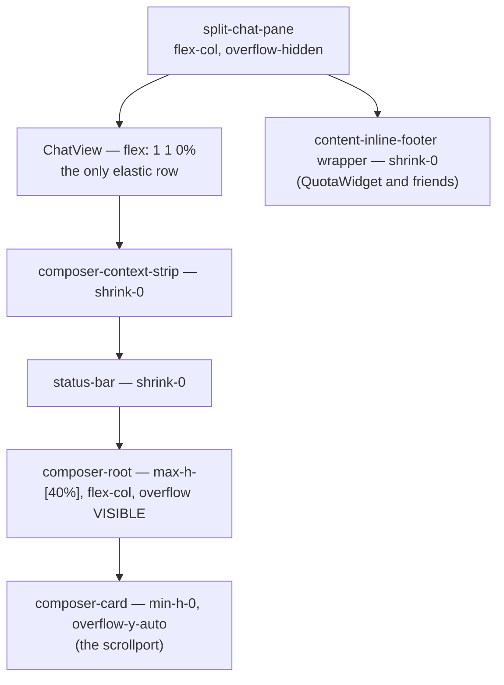

# Design — chat-pane height budget

Written after implementation, at the point of archive. The change entered as a
one-property tweak and did not warrant a design doc; it left as a shared-furniture
layout contract with two non-obvious constraints that a future editor will
otherwise re-break. Those constraints are the reason this file exists.

## Where the height goes

`split-chat-pane` is `flex-col overflow-hidden`. Its children, top to bottom:



Only `ChatView` is elastic. Every other row has `min-height: auto`, which floors it
at min-content — so `flex-shrink: 1` on those rows is decorative. When the pane
shrinks, `ChatView` surrenders its grow allocation (measured `23 → 13 → 3 → 0`) and
then has nothing left to give; the furniture below overflows and `overflow-hidden`
cuts the last child. The quota bar is last, so it is the visible symptom.

## Decision 1 — bound the composer to a fraction of the pane, not to pixels

`max-h-[40%]` on `composer-root`.

A pixel cap was rejected: the correct cap depends on the pane, and the pane varies
by viewport, split ratio, and mobile stacking. A percentage is self-adjusting, and
it guarantees the transcript a share by construction — `60%` of the pane is never
claimable by the composer, which is what also fixes the collapse-to-zero defect.

Tradeoff, accepted deliberately: at a comfortable pane the composer now stops at
`183px` where it previously grew to `262px`. It scrolls past that point instead of
growing. Bounded-and-scrollable beats unbounded-and-clipping, but this **is** a
visible behavior change for anyone who types long drafts.

## Decision 2 — the scrollport is `composer-card`, never `composer-root`

This is the constraint most likely to be re-broken, because the naive placement is
one element too high.

`composer-root` is `position: relative`, which makes it the **containing block for
the `/command` and `@file` autocomplete dropdowns**. Those dropdowns render
*upward*, outside the composer's own box. Putting `overflow-y-auto` on
`composer-root` therefore turns it into a scrollport that clips its own absolutely
positioned descendants — measured: a `269px` dropdown reduced to `0px` visible,
with `272px` clipped above.

The first implementation did exactly that and passed every layout measurement,
because none of those measurements looked at the dropdown. The review caught it.

So: `composer-root` keeps the bound and becomes `flex flex-col` with overflow
**visible** (the dropdown escapes); `min-h-0` + `overflow-y-auto` move to the inner
`composer-card`, which has no positioned descendants that need to escape.

`CommandInput-view.test.tsx` pins both halves — including an explicit assertion
that `composer-root` does **not** carry `overflow-y-auto`.

## Decision 3 — `shrink-0` on the thin rows

`composer-context-strip`, `status-bar`, and the `content-inline-footer` wrapper.

These rows cannot shrink below min-content anyway; marking them `shrink-0` states
that they are not candidates for absorbing a deficit, so the deficit lands where it
can actually be absorbed (the bounded composer, then `ChatView`).

## Rejected alternatives

| Alternative | Why not |
| --- | --- |
| `flexShrink: 0` on the QuotaWidget root | **Measured no-op.** Widget is `13px` at every pane height under both values; sweep `220 → 140` gave `DIFF=0.0`. It never shrinks, so a shrink floor cannot help it. Reverted. |
| Move the widget into `composer-footer` | `footerVisible = focused \|\| text.trim() \|\| pendingImages.length` — the bar would vanish whenever the composer is blurred and empty, i.e. most of the time. |
| Make the furniture stack scroll | Odd UX: a scrolling composer *area* rather than a scrolling composer input. |
| Fix inside `packages/quota-plugin/` | The widget renders correctly. The host region fails to budget for it, and every other `content-inline-footer` contribution has the same exposure. |

## Residual limit

Not a guarantee at every size. Below roughly `145px` of chat pane the floors
(`ChatView 16` + strip `32` + status `25` + bounded composer) sum to more than the
pane and clipping resumes. Measured A/B at a `390×844` mobile viewport:

```
pane:     170 165 160 155 150 145 140 135 130
unfixed:   13  13  13  13  13  13  13  13  13   ← fully clipped throughout
fixed:      0   0   0   0   0   1   6  11  13
```

A stacked mobile split on an `844px` screen gives the chat pane ~`400px`, so the
residual band is not reachable in practice. The spec scenario is worded to match
this floor rather than to promise more than the code delivers.
