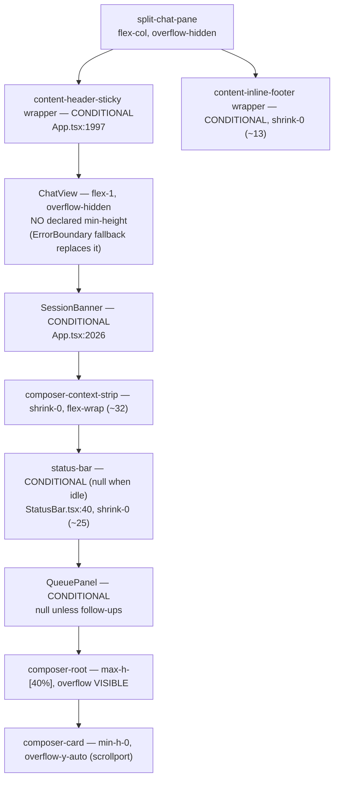

# Design — below-floor height allocation for the chat pane

## Context

See `proposal.md` — Why. The layout shipped by `fix-quota-widget-clipping` is
correct at and above the floor sum; its archived `design.md` documents the row
stack and the two constraints that must not be re-broken.

Rows of `split-chat-pane` (`flex-col overflow-hidden`), top to bottom, as rendered
by `App.tsx` — **most of them conditional**, which the original reading missed:

Five facts drive every decision below. The first four were established by
inspection; the fifth was found by adversarial review and reversed the design.

1. **`ChatView` is `flex-1` with no `min-height` of its own** — basis `0`, wrapper
   `overflow: hidden`, so `min-height: auto` resolves to `0` and the transcript
   absorbs **nothing** in a shrink pool, whatever its shrink factor. The `16px`
   floor in the measurements is emergent, not declared — there is no constant to
   point a rule at yet.
2. **The floor sum is state-dependent.** Header slot, banner, status bar, queue
   panel and the footer slot come and go. "The floor sum" is a function of what is
   rendered, never a fixed number, and any test written against one threshold
   pixel value is wrong on arrival.
3. **The floor sum is also height-dependent.** `max-h-[40%]` means the composer's
   base is `min(content, 0.4 × pane)` — the threshold the pane is compared against
   is itself a function of the pane's height.
4. **`shrink-0` lives in three different files** — `StatusBar.tsx:47` (inside the
   shared component), the context strip and the footer wrapper in `App.tsx`. Any
   row-level change spans component boundaries.
5. **A row that neither clips nor scrolls cannot shrink below its content.** It
   would paint the overflow over its neighbour, not hide it — trading a clipped
   quota bar for a quota bar on top of the composer. So its lower bound must equal
   its content height, which in CSS means `min-height == flex-basis`, which the
   flexbox shrink algorithm (§9.7) **freezes from step one**. Live proof: today
   `QueuePanel` and the sticky-header wrapper already carry the default
   `flex-shrink: 1` + `min-height: auto` and demonstrably never shrink.

## Goals / Non-Goals

**Goals:**

- Classify every row — including every conditional one — as shrinkable or fixed,
  explicitly and in one place.
- Below the floor sum, share the deficit across the rows that *can* give, by
  declared weight, with hard lower bounds; clip only after they have all bottomed
  out.
- Behavior at and above the floor sum bit-for-bit unchanged.

**Non-Goals:**

- Changing the `40%` composer bound, the `composer-card` scrollport placement, or
  the `overflow: visible` on `composer-root` (autocomplete containing block).
- Eliminating residual clipping. Once the scrollable rows are at their bounds the
  pane is still over-subscribed; something gets cut.
- Making the band comfortable. The goal is a defined, deliberate contract.

## Decisions

### Decision 1 — two row classes: shrinkable (owns a scrollport) vs fixed

Only a row with its own scrollport can lose height without spilling. That is the
transcript (`ChatView`'s inner scroll container) and the composer (`composer-card`
is already `min-h-0 overflow-y-auto`). Everything else — header slot, banner,
context strip, status bar, queue panel, footer slot — is **fixed**: it keeps
`shrink-0`, holds content height, and is documented as a non-participant.

Alternative considered and rejected: give every row a weight and a sub-content
lower bound. Fact 5 kills it — either the bound is `min-height: auto` (the row
freezes, weights are decoration, the deficit still lands on the last child) or it
is a static px value below content (the row paints over its neighbour, and breaks
whenever the strip wraps or the queue grows). There is no third CSS spelling.

Alternative considered and rejected: a `ResizeObserver` allocator that measures and
writes pixel heights, which *could* distribute across all rows. It reimplements the
layout engine one frame late, adds a reflow on every divider drag (the divider is
dragged continuously), and needs its own ordering contract against the transcript
virtualizer. Weighed against a band reachable only at minimum divider ratio, the
complexity is not worth it — see `proposal.md` Priority.

### Decision 2 — declared weights apply to the two shrinkable rows

| Row | Class | Weight | Lower bound |
| --- | --- | --- | --- |
| `ChatView` transcript | shrinkable | 3 | `16px` hard bound; declared floor (basis) `64px` — see Decision 4 |
| `composer-root` | shrinkable | 1 | `72px` — `38px` textarea + root `p-3` + card padding + border. **Not** `38px`: that is the textarea's own min, and on the root it would leave a ~13px scrollport |
| `content-header-sticky` wrapper | fixed | — | content height |
| `SessionBanner` | fixed | — | content height |
| `composer-context-strip` | fixed | — | content height |
| `status-bar` | fixed | — | content height |
| `QueuePanel` | fixed | — | content height |
| `content-inline-footer` wrapper | fixed | — | content height |

Weight `3:1` favours the transcript, which is the row that loses least by
shrinking (its content stays reachable by scrolling; the composer's draft area
becomes unusable fast). Flexbox distributes by `weight × base size`, so the
transcript's small base partially offsets its larger weight — the spec states the
rule as *weight applied to the row's own base height* rather than "weight alone",
which flexbox cannot deliver.

With two real participants, both the sharing scenario and the
one-hits-its-bound-and-the-other-absorbs scenario are exercisable. Under the
rejected all-rows design they were vacuous.

### Decision 3 — the ErrorBoundary fallback inherits the transcript's slot

`App.tsx:2003` swaps a padded `flex-1` fallback `div` in for `ChatView` when the
boundary trips. It does not scroll, so under Decision 1 it is **fixed** — but it
occupies the transcript's slot, so the pane in that state has only one shrinkable
row. Bounding it at the transcript floor would paint its padding over the banner.
It holds content height and the composer absorbs alone; the spec's ordering
guarantee still holds.

### Decision 4 — a shrinkable row's basis MUST exceed its lower bound

This is the trap that killed the previous design, and it applies just as ruthlessly
to the two rows left standing: **flexbox freezes an item whose base size already
equals its minimum**, before any weight is consulted. So declaring the transcript
`flex: 3 3 <floor>` *and* `min-height: <floor>` — the same constant in both slots,
as an earlier draft of this document did — produces a row that absorbs exactly
nothing. Weight `3` would be decoration and the deficit would land, again, on the
bottom-most row.

Two distinct constants, therefore:

- **Declared transcript floor** — `64px` (~2 message lines): the flex basis and the
  transcript's share of the floor sum, comfortably above the hard bound. Chosen to
  keep the floor sum near today's measured `~145px` rather than pushing the band
  higher.
- **Hard lower bound** — `min-height: 16px`. `ChatView` renders through TanStack
  Virtual, which measures its viewport; a `0` bound hands the virtualizer a
  zero-height viewport to compute overscan against.

The transcript is spelled `flex: 3 3 <declared floor>` with `min-height: <hard
bound>` — shrink factor equal to the declared weight, not the `1` an earlier draft
wrote. It can then travel the whole distance between the two constants.

The same rule binds the composer: `composer-root` has `overflow: visible`, so its
`min-height: auto` resolves to its content height and it would freeze identically.
It needs an **explicit** `min-height` (one usable input line) for its weight to
mean anything. It can give that height safely because `composer-card` inside it
owns the scrollport — the same mechanism `max-h-[40%]` already uses today.

Because the fixed rows' bases are their content heights, `sum(bases)` — with the
transcript contributing its declared floor — **is** the floor sum. Flexbox starts
shrinking exactly when the pane drops below it, which is what keeps "above the
floor sum nothing shrinks" true, and why the fixed rows can keep `shrink-0`
without moving that boundary.

### Decision 5 — residual clipping is declared, not allocated

Once both shrinkable rows sit at their bounds the pane is still over-subscribed and
`overflow: hidden` cuts the bottom-most row. The spec permits this **only** at
those heights. The guarantee this change actually buys is ordering: nothing is
clipped while a scrollable row still has height to give. The original symptom (the
quota bar clipped while the transcript sat comfortably) is what that forbids.

## Risks / Trade-offs

- **The fixed rows still lose in the residual band** → accepted and specced, not
  papered over. Eliminating it needs the JS allocator rejected in Decision 1.
- **`max-h-[40%]` clamps the composer's flex base before distribution** → its share
  falls as the pane shrinks, and below the floor sum `min-height` and `max-h`
  cross, where min wins in CSS. Both pinned by tests rather than reasoned about.
- **Either shrinkable row can be silently frozen by a min/basis collision
  (Decision 4)** → a freeze is invisible in review and looks exactly like the bug
  this change fixes. A test asserts both rows are strictly shorter than their bases
  just below the floor sum, which is the direct disproof of a freeze.
- **The floor sum is state- and height-dependent (Facts 2–3)** → tests compute it
  from measured row heights at the tested pane state instead of hardcoding a
  threshold, and cover at least one state with a conditional row present.
- **Touching shared chat furniture across three files (Fact 4)** → the row class
  table above is the single place the classification lives; `StatusBar` keeps
  owning its own `shrink-0` rather than having the host reach into it.

## Open Questions

None.
