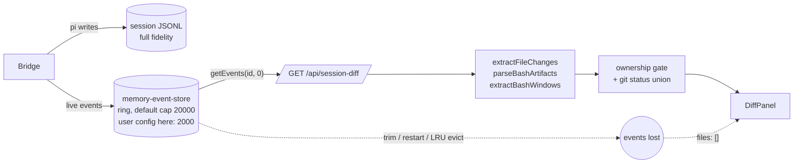

# Design — fix-session-diff-durable-source

## Context

Today's data flow and where it breaks:



Loss modes observed, all with the transcript intact on disk:

| Mode | Trigger | Store contents |
|---|---|---|
| Per-session trim | `> maxEventsPerSession` events; `tool_execution_start` is non-essential so it goes first | chat head only |
| Server restart | any | empty for pre-restart sessions |
| LRU eviction | `> maxSessions` (100) tracked | empty |
| Resume/reopen | `loadAndReplay` replays into the store — works, but then subject to trim again | partial |

Existing pieces that already solve the sub-problems:

| Piece | Where | Does |
|---|---|---|
| `loadSessionEntries(path)` | `session/session-file-reader.ts` | sync JSONL → `SessionEntry[]`, leaf→root branch walk; `[]` on missing / corrupt / bad header |
| `loadAndReplay(req)` | `session/session-load-worker.ts` | `loadSessionEntries` + `replayEntriesAsEvents`, off-thread, `{events, entryCount}` |
| `createSessionLoadWorkerPool` | `session/session-load-worker-pool.ts` | slots = `min(maxConcurrentSpawns, cpus)`, FIFO, cancel, in-process fallback; owned by `DirectoryService` |
| `SessionDiffCache` | `session/session-diff-cache.ts` | key `sessionId:HEAD:djb2(porcelain)`, 2 s TTL, single-flight |
| `originOf` / `mayReadLocalSessionFile` | `session/session-origin.ts` | local-vs-remote origin; the local-read security boundary for `sessionFile` |

Two facts the design relies on (verified):

- pi persists the assistant message (`sessionManager.appendMessage`) on
  `message_end`, **before** it emits `tool_execution_start`. The `toolCall`
  entry is on disk before the tool runs — the transcript is never behind the
  store for diff purposes.
- The transcript is append-only. Every tool call adds bytes, so `size` strictly
  increases per call; `mtime` granularity is irrelevant to invalidation.

## Goals / Non-Goals

Goals
- `/api/session-diff` returns the session's Write/Edit/Bash-attributed files
  regardless of event-store state, for **local** sessions.
- Zero change to extraction, gating, git enrichment, response shape, client.
- No new main-thread synchronous file I/O on the request path.
- Cache still coalesces concurrent requests; a cache hit never parses the
  transcript; a new tool call always invalidates.
- Ownership gating is no worse on the transcript path than on the store path.

Non-Goals
- Rehydrating the event store on boot.
- Changing the store's trim or ingest behaviour (see D6 — deliberately
  dropped; the only touch is exporting its existing truncation helper).
- Transcript-sourced diffs for remote (gateway) sessions (see D5).
- Any change to what counts as "owned".

## Decisions

### D1. Transcript is the primary source; store is the fallback when the transcript is missing or empty

Alternatives considered:

| Option | Pros | Cons |
|---|---|---|
| A. Store-first, transcript when `trimmedEvents.bySession[id] > 0` or store empty | no disk read for short live sessions | two code paths; "store empty" is ambiguous (restart vs no-activity); `trimmedEvents` resets on eviction → false negatives |
| B. Only extend the trim-protected set | 5-line change | does nothing for restart/eviction — the majority of ended sessions; breaks `preserve-chat-head` under Pass 2 (see D6) |
| **C. Transcript-first, store when the transcript yields no entries** | one path, one source of truth, matches `/api/session-change` | disk read per uncached request |

C chosen. Fallback condition: the transcript **does not exist, or parses to zero
entries** (`loadSessionEntries` returns `[]` for a missing file, a bad header,
or no parseable lines; individually malformed lines are skipped, not fatal). In every one of those cases the store cannot be
*worse* than the transcript, so the store is the right answer; in every other
case the transcript is a superset of what the store ever held for the events
the diff reads. (Subagent-authored tool calls are not in either: they reach the
parent buffer as `subagent_*` carrier events, never as `tool_execution_start`,
so `extractFileChanges` has never seen them. Unchanged.)

The fallback is decided *inside* the cache compute (after the worker returns),
so the cache key must not depend on which branch runs — see D3.

Gate for the transcript path: `mayReadLocalSessionFile({ origin: originOf(session), sessionFile })`
— the existing local-read security boundary. It is false for remote-origin
sessions (whose `sessionFile` is a path on the remote host) **and** for local
sessions with no `sessionFile` yet; both take the store path. Remote sessions
are otherwise unchanged (D5).

### D2. Parse runs in the session-load worker pool, *inside* the cache compute, with a diff-only projection

`buildSessionDiffCached` today takes a materialised `events` array and computes
the key inside. Loading the transcript before calling it would parse on every
cache hit — defeating the cache the moment the source becomes disk. So the
signature changes to take a **loader**:

```
type DiffEventSource = { events: DashboardEvent[]; lastEntryTs?: number }
buildSessionDiffCached(sessionId, load: () => Promise<DiffEventSource>, cwd, cache, { sourceKey, ended })
  key = `${sessionId}:${headSha}:${djb2(porcelain)}:${sourceKey}`
  return cache.run(key, async () => {
    const src = await load()
    return buildSessionDiff(src.events, cwd, { gitRepo, porcelainRaw,
      windowEnd: ended ? src.lastEntryTs : undefined })   // D4
  })
```

A cache hit or a coalesced request never invokes `load`. Single-flight is
unchanged.

`load` for a transcript-eligible session dispatches to the pool with a new
request `mode: "diff-events"`; if the worker returns zero entries it returns
the store's events instead (D1 fallback, decided here). In `diff-events` mode
the worker projects `SessionEntry[]` to **only** the events the diff reads —
`message_end` (assistant, text parts only), `tool_execution_start`,
`tool_execution_end` — in **live order**: an assistant message's `message_end`
*before* the `tool_execution_start` events for its tool calls — and returns
`lastEntryTs` = the max timestamp over **all** entries (not just projected
ones). `replayEntriesAsEvents` emits the opposite order (starts first, then
`message_update` + `message_end`, each carrying the full message), which would
(a) attribute each change to the *previous* assistant message and (b)
structured-clone ~2× the transcript back to the main thread.

**Payload parity with the store.** The store caps tool `args` on ingest
(`memory-event-store.ts::truncateStrings`: long strings → `…[truncated]`
suffix, `edits` arrays > 20 → `"[array truncated]"`), and `extractFileChanges`
turns that marker into `truncated: true` so the client lazy-fetches the full
payload from `/api/session-change`. The projection applies the **same helper**
(exported from `memory-event-store.ts`; no behaviour change there) to each
projected `tool_execution_start.args`, with the **same cap**: the helper takes
`maxSize` as an argument and the store's cap is constructor config, so the
worker request carries `maxStringSize` from the same `memoryLimits` value
`server.ts` hands the store. Result: a transcript-sourced diff has the same
payload sizes and the same `truncated` flags as a store-sourced one. (Aside,
pre-existing and out of scope: the `content.endsWith("…[truncated]")` check in
`extractFileChanges` never fires for Write content because `capString` keeps
head+tail with a middle marker; only the `edits` arm is live. Parity holds
either way because both paths run the same helper.)

**Open tool calls are left open on purpose.** `replayEntriesAsEvents` closes
orphaned calls with a synthetic end; the projection does not. In a *live*
session an open call is a running tool and its Bash window must stay
`[start, now]` exactly as on the store path; pi writes a `toolResult` for an
aborted tool, so the only way a call stays open for good is process death —
which ends the session and hands the window to the D4 clamp. The
projection lives in `packages/server/src/session/` (it needs the server-side
helper), unit-tested for order, event set, and truncation parity against a
store-ingested event.

Pool access: `DirectoryService` owns the pool lazily (today it re-creates on
demand whenever the field is null); it **gains** `ensureLoadWorkerPool()` —
creates on first call, returns `null` once a new disposed flag is set by
`stopPolling` — and `server.ts` passes it into `registerSessionRoutes` as an
**optional** `loadWorkerPool?: () => SessionLoadWorkerPool | null`
dependency. When absent or `null` (unit tests, disposed) the loader runs the
same projection in-process via `loadAndReplay` — the degraded mode reopen
already has; documented in Risks.

The route holds no pool slot while git runs: the pool promise resolves with the
event array before `buildSessionDiff` spawns anything.

### D3. Cache key gains a source signature

`sourceKey` is computed on the main thread before `cache.run`, and which
signature it carries follows the D1 **gate** (known before the parse), not the
zero-entry fallback (known only inside the compute):

- Gate passes → `t:${mtimeMs}:${size}` from one async `fs.stat(sessionFile)`;
  **any** stat error (ENOENT, EACCES, …) → `t:0:0` ("no transcript", never a
  500). A new tool call appends bytes → size changes → new key, even when
  `git status` is unchanged (editing an already-dirty file). Streaming deltas
  do not touch the file, so a request during a response with no new tool call
  is a cache hit — the spec's "HEAD, dirty state and transcript unchanged"
  scenario holds.
- Gate fails (remote, or no `sessionFile` yet) → `s:${n}` where `n` is the
  count of Write/Edit/Bash `tool_execution_start` events in the store for the
  session — the only events whose arrival can change the diff. Not the raw
  event count (streaming deltas would churn it) and not `maxSeq` (same).
  Computed by one pass over the in-memory buffer; these sessions are either
  brand-new (tiny) or remote (bounded by the cap).

The one case where key and source disagree: gate passes but the transcript
parses to zero entries (bad header / nothing persisted yet) → key is `t:`,
result comes from the store. pi buffers persistence until the first assistant
message and persists that message before its tools run, so in the "nothing
yet" case the store has no tool events either and the result is identical.
For a bad-header file the store-sourced result can be stale for at most the
cache TTL (2 s) — accepted.

### D4. Ended sessions clamp open Bash windows to the transcript's last entry

`extractBashWindows` closes windows on `tool_execution_end`; an unclosed window
(aborted Bash, missing `toolResult`) becomes `[start, now]`. That is right for
a running session and wrong for one that ended days ago — it would claim every
file touched in the cwd since. `buildSessionDiff` gains
`opts.windowEnd?: number`, threaded to `extractBashWindows(events, windowEnd)`.
The compute passes `lastEntryTs` from the loader when
`session.status === "ended"`; otherwise undefined (→ `Date.now()` as today).
Store-path loads report `lastEntryTs` = the last store event's timestamp. A
session misclassified as ended while still running is clamped to its last
entry — under-attribution of an *aborted* Bash's window only; Write/Edit
ownership is unaffected.

### D5. Remote sessions: unchanged (store path)

The retained copy lives in `remote-transcript-store` (`read()` is a sync
`readFileSync` returning `string[]` lines, possibly capped with a stale
`.complete` marker). Adapting it would need an async/path-based read variant
and a partial-copy policy — for a surface where git enrichment is already a
no-op (`isGitRepo:false`, the cwd is on another machine). Out of scope: remote
sessions fail the D1 gate and take the store path; their `sessionFile` is
never stat'ed or opened locally; output is as today. Follow-up change if wanted.

### D6. Trim-protected set: NOT extended (dropped from scope)

The scaffold proposed making Write/Edit/Bash `tool_execution_start` essential in
`memory-event-store.ts`. Rejected on review: `trimBufferToLimit` Pass 2 is a
blind `splice(0, n)` over the essential set with no pair awareness, commented
"pathological; never hit in practice" *because* essentials are only chat
events. Subagent sessions forward inner tool events into the parent buffer;
a Bash-heavy session at the user's 2000 cap would push Pass 2 into routine
use and splice `message_start`/`message_end` and `inline_terminal_open`/`close`
mid-pair — breaking `preserve-chat-head`. The diff no longer depends on the
store, so there is no need to touch the trim policy. The live-stream surfaces
(late-joining browser replay) keep today's behaviour.

## Risks / Trade-offs

- **Parse per Write/Edit on an active session.** `SessionDiffContext` refetches
  on every Write/Edit event (`changeSignal`), and each such call changes the
  transcript `size` → new key → a full worker parse. Parse rate therefore
  equals the session's tool-call rate while the Diff panel is open; the 2 s
  TTL does not help. It is off the main thread and one worker slot at a time
  per session (single-flight), so the cost is worker CPU + FIFO latency. Task
  measures p50 on a ~20 MB transcript; if it is a problem, a follow-up adds an
  incremental tail parse keyed on byte offset (the transcript is append-only).
- **Pool in-process fallback.** Two triggers run a load on the main thread
  (`loadAndReplay` → `readFileSync` + parse): (a) worker spawn failure sets
  `workersDisabled` permanently; (b) the per-request 30 s timeout kills the
  slot and `fallbackSettle`s that request in-process. Both are the degraded
  mode the reopen path already accepts; (a) is rare, (b) needs a > 30 s parse
  or a starved queue. Documented, not fixed here.
- **Pool contention with reopen jobs — both directions.** Diff loads queue
  FIFO with reopens and have no cancel wiring; several busy sessions with the
  Diff panel open can delay a user-initiated reopen by a few parse durations.
  Acceptable at current session counts; revisit with the measurement.
- **Store-path sessions' cache invalidates on new tool calls** (key gains
  `s:<tool-start count>`). Correctness unchanged; strictly fresher; the extra
  per-request cost is one pass over an in-memory buffer.
- **Store momentarily ahead for `tool_execution_end`.** pi emits before it
  persists, so a `toolResult` can be in the store a few ms before it is on
  disk. A Bash window may therefore read as open on one request and closed
  on the next; the client refetches on the next change anyway.
- **Branched sessions.** `loadSessionEntries` already does the leaf→root walk
  used by resume, so a forked session's diff covers the ancestry exactly as
  its replay does.
- **Behaviour change for short local sessions**: none observable — the
  projection yields the same three event types the store would have held.

## Migration Plan

Single deploy; no persisted data changes; no protocol change. Rollback = revert.

## Open Questions

None blocking. The scaffold's two questions are resolved above: the worker
needs a `diff-events` projection (D2, decided on correctness grounds, not cost);
remote sessions do not take the transcript path (D5).
