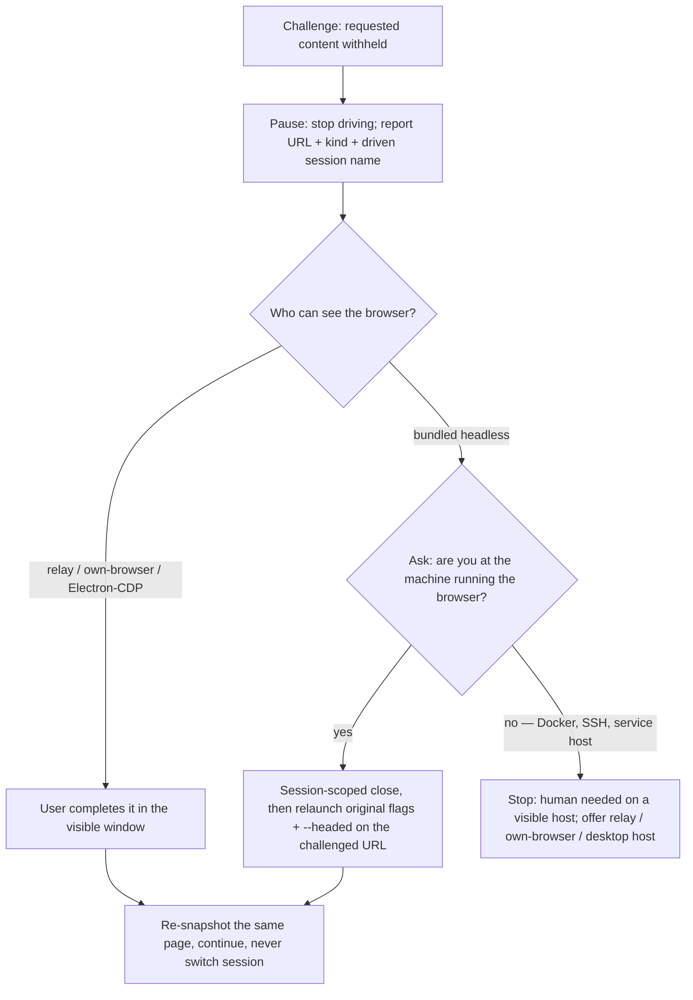

# Interactive challenges — pause, hand off, resume

Authored for this repo, not vendored from upstream (see
[`UPSTREAM.md`](../UPSTREAM.md)).

An interactive anti-bot challenge is a **stop sign, not an obstacle to
route around**. The site is asking for a human. Your job is to hand it to
the user and continue on the *same* browser afterwards.

**This file takes precedence over every recipe's troubleshooting advice.**
`own-browser.md`'s "re-run under a fresh `--session`" row and `web.md`'s
`close --all` cleanup both address other problems and are *wrong* here —
both throw away the exact session state the site is about to trust.

## What counts as a challenge

The test is the **withheld content**: the page asks a human to prove they
are one *before* showing you what you asked for. Signature alone is not
enough — text such as "Verify you are human" on a documentation page,
forum post, or search result that is *still serving its content* is **not**
a challenge. Keep working.

A short, non-exhaustive list of signatures:

| Kind | Signature |
|---|---|
| Cloudflare Turnstile / browser check | iframe from `challenges.cloudflare.com`; text "Checking your browser" |
| hCaptcha | iframe from `hcaptcha.com` |
| reCAPTCHA | iframe from `google.com/recaptcha` |
| Generic interstitial | text "Verify you are human" |

Genuine churn happens upstream in these vendors' markup — treat the list as
a prompt for what to look for, not a detector.

**Check more than the snapshot.** A snapshot inlines iframe *content*, not
its host, so it can miss the vendor entirely. Use all of:

```bash
agent-browser --session <name> get url
agent-browser --session <name> get title
agent-browser --session <name> eval '[...document.querySelectorAll("iframe")].map(f => f.src)'
```

`read` and the snapshot text catch the interstitial phrasing; `get url` and
`get title` catch the redirect to a challenge path; the `eval` of
`iframe[src]` catches the vendor host. Use `Bash: agent-browser eval …`, not
the MCP `eval` (wrapper bug: it echoes the source instead of running it).

## Pause

Stop driving the page immediately. Do **not**:

- run `close --all` — it is not session-scoped and kills every session,
  including unrelated ones;
- switch to a different `--session` name, a different `--profile`, or a
  different provider;
- re-navigate to the challenged URL hoping it passes;
- reach for the recipe's troubleshooting table — on a challenge this file
  wins.

Report to the user, all three:

1. the challenged URL (`get url` at pause time — not the task's start URL),
2. the challenge kind (Turnstile / hCaptcha / reCAPTCHA / browser check),
3. **the session name you have been driving** — the `--session` value your
   own launch command passed, or `AGENT_BROWSER_SESSION` if you relied on
   the env var, or `default` if neither.

Do not run a bare `agent-browser session` to answer #3: it prints the
*environment/default* session name, not the one your task passed.

## Complete — branch on the route you are already on



### Relay / own-browser / Electron-CDP — the user already sees the browser

(The relay recipe lives in `references/dashboard-relay.md` when that file is
present.) Ask the user to complete the challenge in that window. On
confirmation, re-snapshot the same page and continue. The session is
untouched — nothing to relaunch.

### Bundled headless — ask before you assume a display

The user cannot see the bundled browser, and a running daemon cannot flip
headless → headed in place, so the agent has to relaunch. First ask:

> Are you at the machine running the browser?

Do **not** infer this from `$DISPLAY` — it is empty on macOS and set under
`ssh -X`, so it is wrong in both directions.

**Yes — display available.** From Bash (the MCP `browser` tool shares the
same daemon and session, so Bash is the relaunch surface either way):

1. Session-scoped `close`, with the same `--session` / `--namespace` flags
   you launched with — never `close --all`:

   ```bash
   agent-browser --session <name> [--namespace <namespace>] close
   ```

   Tolerate failure: if the daemon already idled out, `close` errors.
   Ignore it and go on.

2. Relaunch with **all your original launch flags verbatim**, plus
   `--headed`, opening the challenged URL:

   ```bash
   agent-browser --session <name> [<original flags>] --headed open <challenged URL>
   ```

   "Repeat the original flags" is deliberately not a list here: it keeps
   `--restore`, `--profile`, `--state`, `--namespace`, `--cdp`, and anything
   else in play without you having to remember them.

3. Ask the user to complete the challenge in the visible window and confirm.

**Say this out loud to the user:** a session launched without `--restore`,
`--profile`, or `--state` starts the headed relaunch with **empty cookies**.
That is by design — a task that needed login state should already have been
on relay / own-browser. The clearance the user just earned lives in the
headed browser you now keep driving, so the task still works.

**Note:** if your session is `default`, its `close` also drops the MCP
`browser` tool's page — both surfaces share one daemon. That affects this
task only.

**No — no display** (Docker harness, SSH, service context). `--headed`
cannot work. Stop, tell the user the site needs a human on a host with a
visible browser, and offer the relay / own-browser route or running the task
from a desktop host. Do not attempt `--headed`, a virtual display (Xvfb),
or any bypass.

## Resume

The headed browser under the same name **is** the working browser now.
Re-snapshot, continue the task, and do not close it again for the rest of
the task. Do not start a different session name.

If the daemon idle-timed out while the user was away, relaunch exactly as
above — same name, original flags + `--headed` — and resume.

## Challenge reappears after resume

Stop. Report that the site is not accepting the session. Do **not** loop on
retries and do **not** switch identity — a second relaunch, a new
`--session`, or a UA change is exactly what the challenge is testing for.

## Never

The never-list is absolute. Every item below is a bypass attempt, and a
challenge is a request for a human — hand it to the human instead.

Never:

- use a CAPTCHA-solving service;
- inject a challenge token or a clearance cookie;
- copy cookies between browser identities;
- rotate proxies;
- change the user-agent, request headers, or `set device` emulation in
  response to a challenge;
- pass launch flags whose purpose is to hide automation — for example
  `--args --disable-blink-features=AutomationControlled` (the CLI's own help
  happens to show this one);
- inject JavaScript whose purpose is to falsify automation signals.

## Related

- Default bundled-browser workflow: [`web.md`](web.md)
- Electron apps: [`electron.md`](electron.md)
- The user's logged-in browser: [`own-browser.md`](own-browser.md)
- Provenance / refresh rules: [`../UPSTREAM.md`](../UPSTREAM.md)
